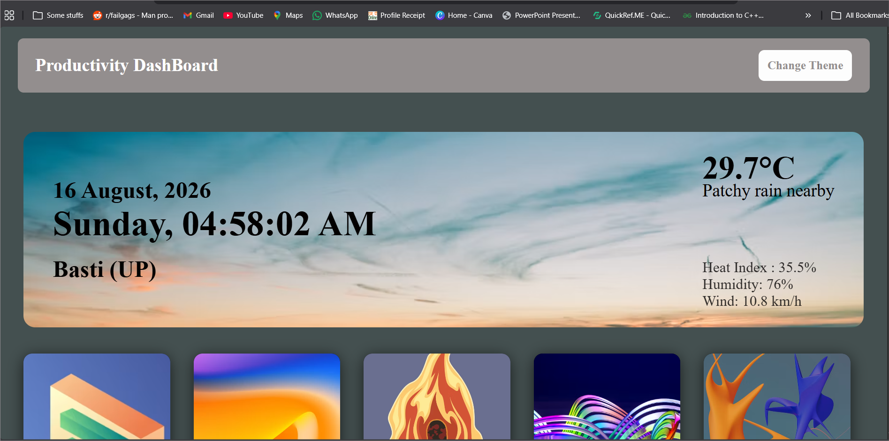
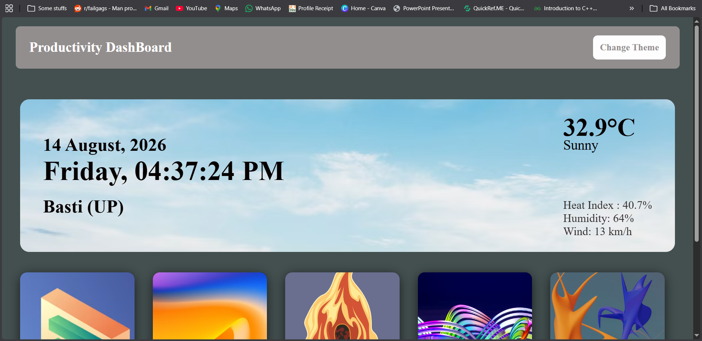
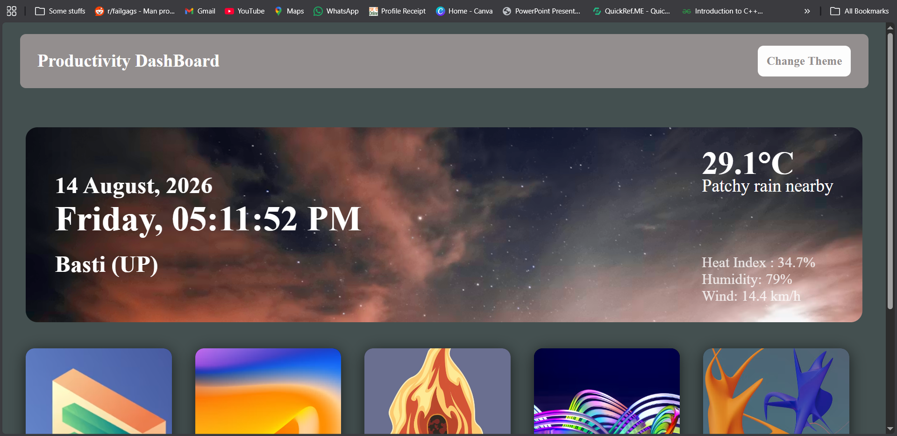
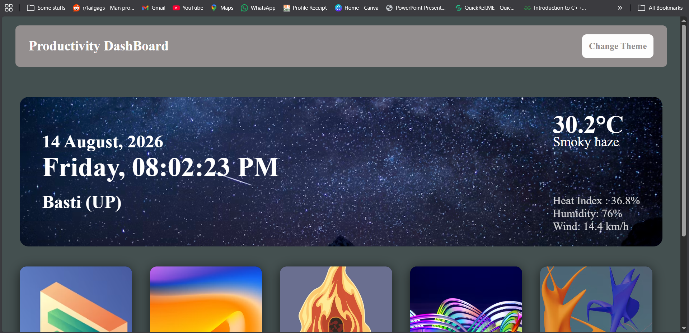
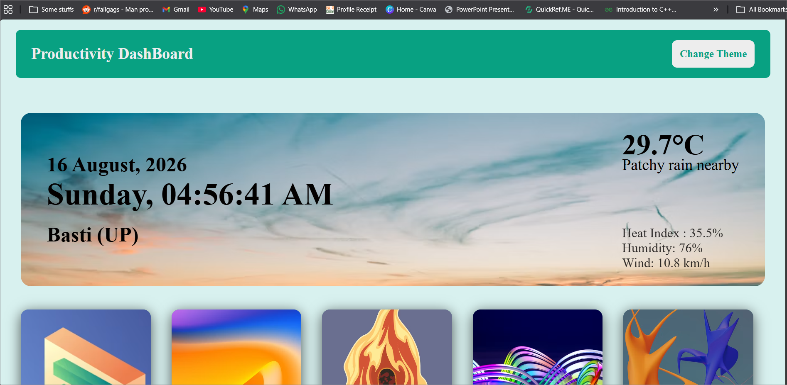
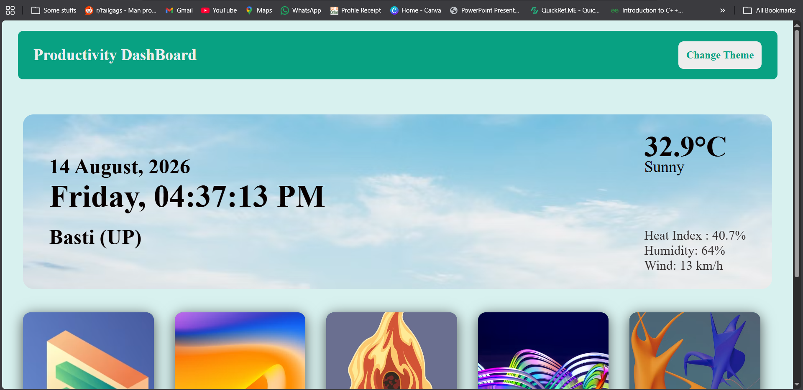
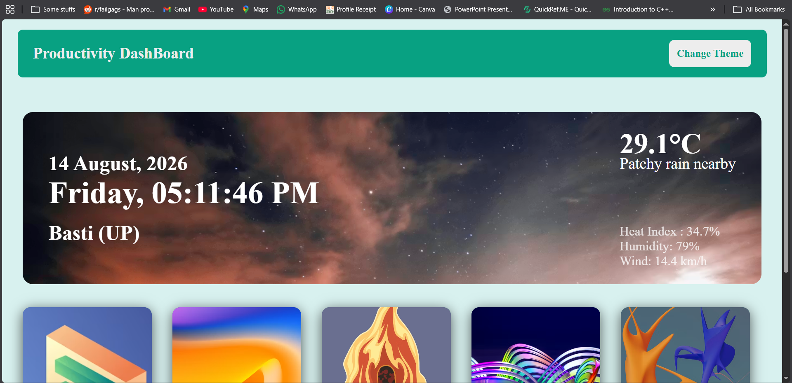
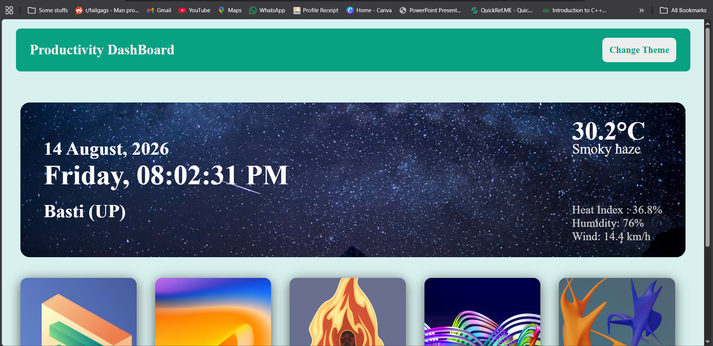

# 🚀 Productivity Dashboard
**Clean & Interactive Time Management System**

Productivity Dashboard is an interactive web application designed to help users track tasks, manage time efficiently, set daily milestones, and stay inspired. 

🔗 **Live Demo:** [Productivity Dashboard](https://git-jayendra.github.io/Productivity-Dashboard/)

---

## 📸 Screenshots

### 🌑 Dark Theme
* **Early Morning:**
  
* **Morning:**
  
* **Evening:**
  
* **Night:**
  

### ☀️ Light Theme
* **Early Morning:**
  
* **Morning:**
  
* **Evening:**
  
* **Night:**
  

---

## 🎥 Project Demo
📹 **Productivity Dashboard Demo Video**

Watch the complete walkthrough of the Productivity Dashboard application in action. The demo showcases all features including task management, Pomodoro timer, daily planner, and dynamic themes.

The complete project demonstration is available in the videos folder of this repository.  
👉 **🎬 View Project Demo Videos**

---

## ✨ Features
* **✅ Task Management:** Add, complete, and track tasks with data saved locally using Browser LocalStorage.
* **📅 Daily Planner:** Plan your day using an hour-by-hour agenda.
* **⏱️ Pomodoro Timer:** Built-in 25-minute deep-work timer.
* **🎯 Daily Goals:** Set daily milestones and mark them as completed.
* **🌤️ Real-Time Weather:** Live weather updates for Basti, Uttar Pradesh, with dynamic backgrounds.
* **💡 Motivational Quotes:** Fetches random quotes to keep you inspired.
* **🎨 Dynamic Themes:** Easily switch between custom UI themes.

---

## 🛠️ Tech Stack
HTML5 • CSS3 • Vanilla JavaScript • WeatherAPI • DummyJSON • Git • GitHub

---

## 🔄 How It Works
```text
User Input (Tasks / Goals / Planner)
            ↓
    JavaScript Processing
            ↓
 Browser LocalStorage (Data Saving)
            ↓
     UI DOM Update & Rendering
            ↓
 External API Calls (Weather / Quotes)
            ↓
 Dynamic Interface Adjustments

```
---

## 👨‍💻 Author
Jayendra Pandey

  [GitHub ](https://github.com/git-Jayendra)
